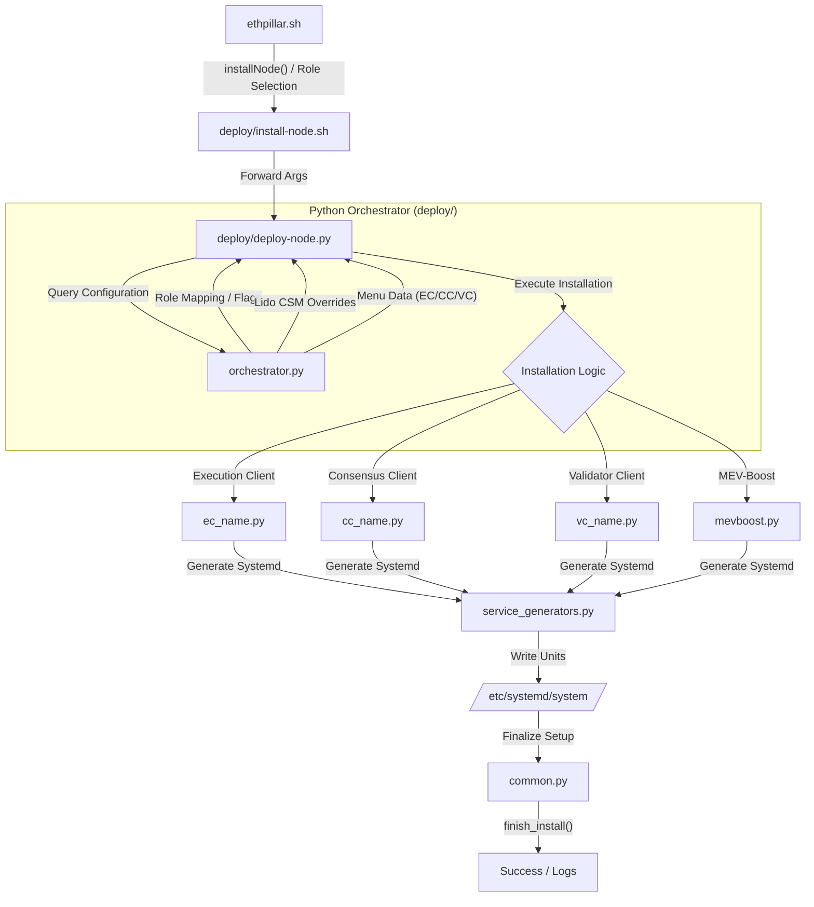

# EthPillar Deployment Flow

This document describes the orchestration logic for installing Ethereum nodes.

## Orchestration Flowchart

## Setup Sequence

1.  **Network Selection**: (Mainnet, Holesky, Sepolia, etc.)
2.  **Role Selection**:
    *   **Solo Staking**: EC + CC + VC + MEV
    *   **CSM**: Solo Staking with Lido Overrides
    *   **Full Node**: EC + CC only
    *   **VC Only**: External BN + local VC
    *   **Custom**: Granular selection of all components
3.  **Client Selection**:
    *   If Custom: Pick EC, then CC, then VC.
    *   If Predefined: Pick from `PREDEFINED_COMBOS`.
4.  **Parameter Collection**: JWT, Fee Recipient, Graffiti, Sync URLs.
5.  **Execution**:
    *   `common.setup_node()`: JWT creation, user/group setup.
    *   Execution Client installation (download binary + systemd).
    *   Consensus Client installation.
    *   Validator Client installation.
    *   MEV-Boost installation.
    *   `common.finish_install()`: Service reload and completion report.
