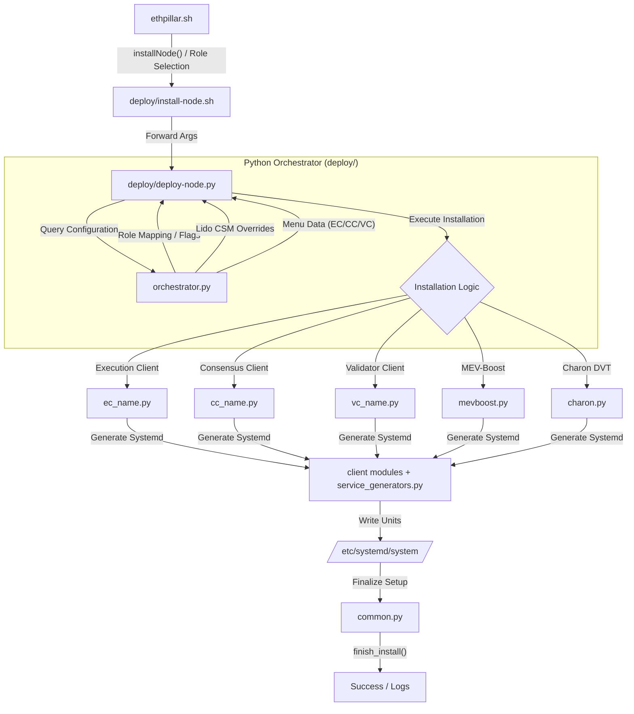

# EthPillar Deployment Flow

This document describes the orchestration logic for installing Ethereum nodes.

## Orchestration Flowchart

```mermaid
graph TD
    A[ethpillar.sh] -- "installNode() / Role Selection" --> B[deploy/install-node.sh]
    B -- "Forward Args" --> C[deploy/deploy-node.py]
    
    subgraph "Python Orchestrator (deploy/)"
    C -- "Query Configuration" --> D[orchestrator.py]
    D -- "Role Mapping / Flags" --> C
    D -- "Lido CSM Overrides" --> C
    D -- "Menu Data (EC/CC/VC)" --> C
    
    C -- "Execute Installation" --> E{Installation Logic}
    end

    E -- "Execution Client" --> F[ec_name.py]
    E -- "Consensus Client" --> G[cc_name.py]
    E -- "Validator Client" --> H[vc_name.py]
    E -- "MEV-Boost" --> I[mevboost.py]
    E -- "Charon DVT" --> N[charon.py]

    F & G & H & I & N -- "Generate Systemd" --> J[client modules + service_generators.py]
    J -- "Write Units" --> K[/etc/systemd/system/]

    K -- "Finalize Setup" --> L[common.py]
    L -- "finish_install()" --> M[Success / Logs]
```

## Setup Sequence

1.  **Network Selection**: (Mainnet, Holesky, Sepolia, etc.)
2.  **Role Selection**:
    *   **Solo Staking**: EC + CC + VC + MEV
    *   **CSM**: Solo Staking with Lido Overrides
    *   **Full Node**: EC + CC only
    *   **VC Only**: External BN + local VC
    *   **CSM VC Only**: VC Only with Lido Overrides
    *   **Failover Staking Node**: EC + CC + MEV, no VC (backup BN for validators elsewhere)
    *   **Custom**: Granular selection of all components
3.  **Client Selection**:
    *   If Custom: Pick EC, then CC, then VC.
    *   If Predefined: Pick from `PREDEFINED_COMBOS`.
    *   **Obol Charon DV**: listed as a VC choice. Selecting it sets `flags['charon']=True` and re-prompts for the signer VC (no Charon, no Grandine integrated). CLI: `--with_charon --vc Lodestar`.
4.  **Parameter Collection**: JWT, Fee Recipient, Graffiti, Sync URLs.
5.  **Execution**:
    *   `common.setup_node()`: apt packages + JWT secret (users/groups are created per client by `common.setup_client_user_and_dir()`).
    *   MEV-Boost installation.
    *   Execution Client installation (download binary + systemd).
    *   Consensus Client installation.
    *   Charon installation (`deploy/charon.py`) when `flags['charon']`: upstream BN REST → Charon; VC beacon flag → `http://127.0.0.1:3600`. Nimbus BN → Charon `--feature-set-enable=json_requests`. Teku BN → `--validators-graffiti-client-append-format=DISABLED`.
    *   Validator Client installation when Charon is on: `--distributed` for Lighthouse/Nimbus/Prysm/Lodestar; `--Xobol-dvt-integration-enabled=true` and `--Xvalidator-client-beacon-api-executor-threads=50` for Teku.
    *   **Lodestar BN warning**: Charon v1.11+ marks Lodestar BN + Lighthouse/Nimbus/Prysm VC as duties may fail (client-side). EthPillar warns at install/migrate; prefer Lodestar or Teku VC, or a different BN.
    *   `common.finish_install()`: Service reload and completion report. Charon is enabled on boot only if the autostart prompt is accepted, and is started (via the start-syncing prompt) only once `/var/lib/charon/.charon/cluster-lock.json` exists. When monitoring is already present, `manage.charon_monitoring` adds a Prometheus scrape for `:3620` and provisions the Charon Overview Grafana dashboard (also run when monitoring is installed later if `charon.service` exists).

Runtime: `getValidatorMode()` stays `none | separate | integrated_grandine`. Detect Charon via `isCharonEnabled()` (`charon.service`). After a CC switch, `patchValidatorBeaconEndpoint` updates Charon’s `--beacon-node-endpoints` (VC stays on `:3600`), then Charon is `try-restart`ed. Full-stack CDVN migrate: `ethpillar --migrate_cdvn` (`deploy.cdvn_migrate` + `migrateCdvnFull`) detects EL/CL/VC/MEV, deploys the matching role, moves datadirs, overlays `.charon` + `.env` → systemd, and provisions fresh EthPillar monitoring.

Operator guide: [docs/charon.md](../docs/charon.md).
